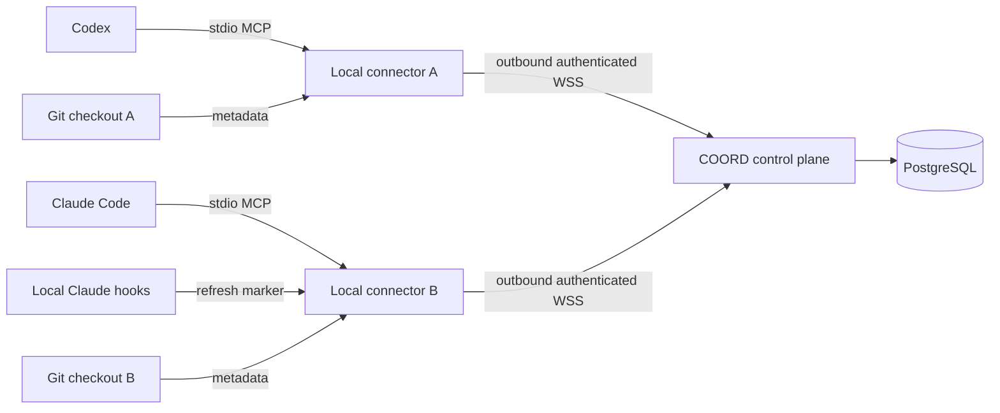

# Architecture

COORD is one control-plane process backed by PostgreSQL, plus one local connector per active coding-agent process. The CLI handles setup and diagnosis. Normal work happens through MCP tools inside Codex or Claude Code.



## Repository ownership and modules

```text
apps/
  control-plane/       HTTP, WebSocket gateway, authorization, transactional service
  cli/                 setup, credentials, binding, diagnostics, daemon and MCP entry
packages/
  protocol/            Zod wire/tool schemas, safe metadata paths and limits
  conflict-engine/     ConflictAnalyzer interface and deterministic file analyzer
  memory/              fact/handoff input types and trust notice
  connector/           Git + presence + lease/intent renewal + private session state
  realtime-client/     authenticated sockets, replay cursor, retry/backoff, bounded queue
  git-intel/           Git discovery, porcelain parser, worktrees, local path checks
  mcp-server/          official SDK tools and stdio entry
  adapters/
    codex/             reversible TOML MCP configuration
    claude/            reversible MCP/hook configuration and local signal handling
migrations/            versioned PostgreSQL schema
scripts/               local native PostgreSQL and private demo-token export
tests/                real database harness, two-connector E2E, security regressions
docs/                 operations, integration, security and protocol documentation
```

## State and transaction boundaries

PostgreSQL is the sole durable authority. The schema stores organizations, users, project memberships, device token hashes, sessions, tasks, exclusive claims, work intents, conflicts, messages, facts, handoffs, project events and idempotency results. Project repository identity is explicit. Dependencies are UUID arrays on tasks; intent paths and effective Git observation are bounded JSON metadata rather than separate child tables. Local worktree information stays local, with a stable opaque worktree ID sent to the service.

Each operation reauthorizes the token, project membership and device-owned session. Mutations serialize on the project row with `SELECT FOR UPDATE`. This intentionally simple prototype boundary makes claim acquisition, handoff transfer, idempotency records, conflict reconciliation and sequence allocation atomic. A unique task claim prevents duplicate exclusive owners. Database time controls leases. Lock and statement timeouts bound blocked operations.

Every committed change is a project event. Sequence allocation updates the locked project's counter in the same transaction; a rollback rolls back its sequence. Sockets read the ordered durable log after their cursor. Welcome, replay and live requests share a per-socket queue, eliminating a subscribe/replay race. A periodic event pump observes writes committed by other server instances; this avoids requiring a message broker.

## Local connector

The MCP process starts a connector, which authenticates outbound, publishes Git paths, heartbeats every 10 seconds, and renews locally tracked claims/intents every 40 seconds. Default lease and intent TTL are 120 seconds, presence timeout 30 seconds. Configurable short TTLs use correspondingly faster renewal. A private lock prevents duplicate use of a checkout/agent session. Graceful exit ends presence and releases claims; an abrupt transport failure retains identity for reconnect.

Filesystem watches are debounced hints. A periodic Git reconciliation catches missed events. `git status --porcelain=v1 -z` observes staged/unstaged paths, untracked files, deletions and detected renames without reading source files. `rev-parse`, `symbolic-ref`, and `worktree list` discover checkout state, detached HEAD and worktrees. No Git fetch, checkout, merge, hook execution, push or remote agent command is part of coordination.

The connector persists its project event cursor after processing an event. The default process emits events to its local consumers; durable messages/facts/handoffs remain on the server and are retrieved via context. A process restart does not preserve an arbitrary consumer's in-memory event cache. Pending requests queue in memory with a size limit and timeout, preserving their idempotency keys across temporary network reconnect. Uncommitted outbound requests are not a crash-durable outbox.

## Conflict behavior

`FileConflictAnalyzer` groups effective paths by exact repository-relative path and distinct active sessions. Both sides of a rename participate. Read/read and unrelated paths have no conflict. Read/write is informational; write/write warns; create/create, delete/write and rename/write are high severity. Duplicate observations/intent paths collapse to the strongest result. Cloud reconciliation persists active conflicts and resolution events.

These are advisory possible conflicts. COORD neither blocks edits nor automatically merges code. Intent and Git freshness determine detection quality; direct edits without prior announcements can only be observed afterward.

## Extensibility

`ConflictAnalyzer` can later accept symbol/hunk analyzers behind the same candidate interface. Protocol v1 is explicitly versioned. Structured facts and handoffs carry provenance. Richer Codex App Server, OpenCode, Cursor and hosted authentication adapters are deferred until the file-overlap behavior is validated.
